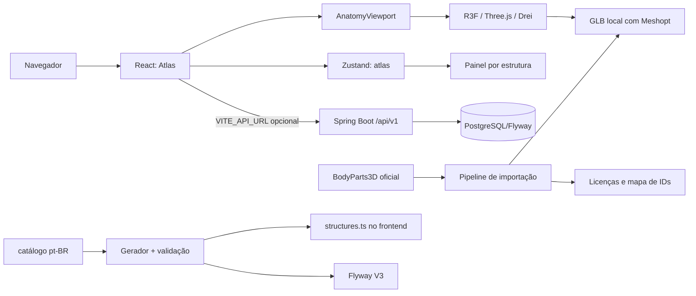
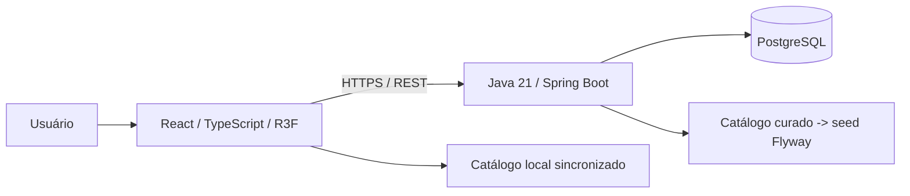

# Anatomia 3D

**Plataforma Web interativa para exploração tridimensional da anatomia humana.**

O Anatomia 3D tem como objetivo combinar renderização 3D em tempo real, dados anatômicos estruturados e uma API REST para transformar o navegador em um atlas humano interativo.

A entrega atual combina o **Milestone 01: First 3D Viewer** com as etapas de **interação** (seleção, destaque, painel por estrutura, visibilidade de sistemas e isolamento) e o **backend Java/Spring Boot** com persistência em PostgreSQL.

| Informação | Estado |
| --- | --- |
| Status | MVP em desenvolvimento |
| Plataforma | Web, com prioridade para desktop |
| Finalidade | Educação, projeto acadêmico e portfólio |
| Entrega disponível | Viewer dos sistemas esquelético e muscular com seleção de estruturas |
| Backend | Java 21 / Spring Boot, implementado com API `/api/v1` |
| Banco | PostgreSQL com migrations Flyway (schema, referência e estruturas) |
| Docker Compose | Backend + PostgreSQL prontos para subir o stack |
| Catálogo educacional | 720 estruturas curadas e revisadas (258 esqueléticas + 462 musculares, pt-BR), com seed e fallback no frontend |
| Deploy público | Pendente |

> **Aviso educacional:** esta aplicação não realiza diagnósticos, não recomenda tratamentos e não substitui material de referência ou orientação profissional. O modelo e o conteúdo atual não foram submetidos a revisão clínica.

## Sumário

- [Visão Geral](#visão-geral)
- [Funcionalidades e Escopo](#funcionalidades-e-escopo)
- [Tecnologias](#tecnologias)
- [Pré-requisitos](#pré-requisitos)
- [Instalação e Execução](#instalação-e-execução)
- [Como Usar](#como-usar)
- [Comandos Disponíveis](#comandos-disponíveis)
- [Configuração e Ambiente](#configuração-e-ambiente)
- [Arquitetura](#arquitetura)
- [Estrutura do Projeto](#estrutura-do-projeto)
- [Modelo 3D e Pipeline](#modelo-3d-e-pipeline)
- [API e Banco](#api-e-banco)
- [Testes e Qualidade](#testes-e-qualidade)
- [Performance e Compatibilidade](#performance-e-compatibilidade)
- [Build e Publicação](#build-e-publicação)
- [Solução de Problemas](#solução-de-problemas)
- [Roadmap](#roadmap)
- [Documentação](#documentação)
- [Contribuição](#contribuição)
- [Licenças e Créditos](#licenças-e-créditos)

## Visão Geral

Livros, atlas e imagens 2D são recursos importantes no estudo da anatomia, mas nem sempre permitem compreender facilmente profundidade, sobreposição, proporções e relações espaciais entre estruturas.

O Anatomia 3D propõe uma experiência em que o usuário pode explorar o corpo humano diretamente: movimentar a câmera, observar diferentes perspectivas e, nas próximas etapas, selecionar estruturas e consultar informações educacionais associadas.

**Público-alvo:** estudantes da área da saúde, professores, estudantes de anatomia e pessoas interessadas em conhecimento científico.

Como projeto de portfólio, a evolução prevista demonstrará integração entre frontend, computação gráfica, API REST, persistência, testes e gestão de assets. A arquitetura completa é um objetivo de desenvolvimento, não uma descrição de componentes já entregues.

## Funcionalidades e Escopo

### Disponíveis

| Funcionalidade | Comportamento atual |
| --- | --- |
| Visualização 3D | Esqueleto humano real, distribuído como GLB local |
| Rotação | Exploração por arrasto com OrbitControls |
| Zoom | Roda do mouse e botões de aproximação/afastamento |
| Pan | Deslocamento do alvo da câmera pelo mouse |
| Vistas anatômicas | Anterior, posterior e lateral |
| Reset da câmera | Retorno à vista anterior e ao enquadramento inicial |
| Restauração geral | Restaura a vista, desativa rotação automática e malha poligonal |
| Rotação automática | Movimento contínuo controlado por checkbox |
| Malha poligonal | Alternância entre material sólido e wireframe |
| Informações do modelo | Visão geral do sistema, fonte, formato e contagem de malhas/triângulos |
| Seleção de estruturas | Raycasting ao clicar; destaque de hover e de seleção sem alterar o asset |
| Painel por estrutura | Nome, nomes alternativos, sistema, região, descrição, função e fonte educacional |
| Visibilidade de sistemas | Checkbox por sistema; apenas sistemas presentes no catálogo são listados |
| Isolamento | "Isolar estrutura" oculta o restante; "Restaurar visão geral" desfaz |
| Limpar seleção | Retorna ao painel resumo do modelo |
| Dados via API | Quando `VITE_API_URL` está configurada, estruturas revisadas são consultadas na API |
| Créditos | Diálogo com atribuição, licença e download do GLB |
| Estados de carregamento | Indicador de carregamento, erro do modelo e aviso de WebGL indisponível |
| Responsividade | Layout desktop e disposição adaptada para telas estreitas |

### Planejadas para o MVP

- Busca com debounce, normalização de texto e foco automático da câmera.
- Relações anatômicas exibidas no painel por estrutura.
- Visualização explodida com posições predefinidas e controle de intensidade.
- Curadoria completa do catálogo pt-BR (720/720 revisadas: 258 esqueléticas + 462 musculares), com migração V3 e fallback do frontend.
- Deploy do stack completo e observabilidade básica.

**O viewer atual consulta a API quando configurada; caso contrário, usa o catálogo local sincronizado. A busca os relações ainda não estão implementadas no frontend.**

### Fora do MVP

Diagnóstico médico, análise de exames, prontuários, autenticação obrigatória, aplicativos nativos, IA generativa, quizzes, gamificação, acompanhamento de alunos, realidade virtual e realidade aumentada não fazem parte da primeira versão.

## Tecnologias

### Em Uso

| Camada | Tecnologia | Papel |
| --- | --- | --- |
| Interface | React 19.2.8 e TypeScript | Componentes, eventos e tipagem |
| Desenvolvimento | Vite 8 | Servidor local e build estático |
| Renderização | Three.js, React Three Fiber e Drei | Cena WebGL, carregamento GLB e controles |
| Estilos | CSS e Tailwind CSS 4 | Estilização e integração com Vite |
| Recursos visuais | Lucide e Fontsource | Ícones e fontes locais DM Sans/Manrope |
| Pipeline 3D | glTF Transform, Meshoptimizer e unzipper | Extração, conversão e compressão de assets |
| Qualidade | ESLint, Vitest e Playwright | Análise estática, testes unitários e smoke test de navegador |
| Verificação visual | pngjs | Análise dos pixels das capturas do canvas |
| Estado compartilhado | Zustand | Seleção, hover, sistemas visíveis e isolamento |
| Backend | Java 21 + Spring Boot 3.5 | API REST `/api/v1` |
| Persistência | PostgreSQL 17 + Flyway | Schema, dados de referência e seed de estruturas |
| Contratos de API | springdoc-openapi | Swagger UI e `/api-docs` |
| Infraestrutura | Docker Compose | PostgreSQL e backend em contêineres |

Zustand centraliza o estado de interação do viewer. O catálogo local de estruturas é gerado a partir de `catalog/catalog.json` e sincronizado para `frontend/src/data/structures.ts`.

### Stack Planejada

Não há stack backend pendente: Java 21, Spring Boot, Spring Data JPA, Flyway, PostgreSQL e Docker Compose já estão implementados. A busca por relações anatômicas no painel e o deploy público continuam em aberto.

As dependências e os scripts são definidos em [package.json](package.json) e [frontend/package.json](frontend/package.json). Os lockfiles registram as versões resolvidas para instalação reproduzível.

## Pré-requisitos

| Requisito | Quando é necessário |
| --- | --- |
| Node.js | Para instalar, desenvolver, testar e gerar o build; recomendado Node 24 LTS, validado com 24.14 |
| npm | Gerenciador utilizado pelo projeto; ambiente inicial validado com npm 11.9 |
| Java 21 (JDK) | Para compilar e testar o backend (Maven wrapper) |
| Maven | Fornecido pelo `mvnw` do backend; nenhuma instalação global obrigatória |
| Docker + Compose | Para subir o stack completo (PostgreSQL e backend) ou rodar os testes de integração |
| Navegador com WebGL 2 | Para visualizar e manipular a cena 3D |
| Aceleração gráfica ou implementação WebGL por software | Para renderização do modelo |
| `curl` | Somente para reconstruir o modelo a partir da fonte oficial |
| Chromium do Playwright | Somente para os testes de navegador |

O setup foi validado em Linux. Outros sistemas operacionais ainda precisam de verificação específica, principalmente para o pipeline que executa `curl` como processo externo.

## Instalação e Execução

Com o código disponível localmente, abra um terminal na **raiz do projeto**, onde estão as pastas `frontend`, `assets` e `scripts`.

### 1. Instalar as dependências

```sh
npm ci
npm --prefix frontend ci
```

Existem dois pacotes npm independentes: a raiz contém os comandos de conveniência e as ferramentas de assets; o frontend contém a aplicação. Instalar apenas na raiz não instala as dependências do frontend.

### 2. Iniciar a aplicação

```sh
npm run dev
```

Abra a URL exibida pelo Vite, normalmente **http://localhost:5173/**. Se a porta estiver ocupada, o servidor de desenvolvimento poderá selecionar outra; use a URL efetivamente informada.

Para definir explicitamente endereço e porta, execute o script do frontend:

```sh
npm --prefix frontend run dev -- --host 127.0.0.1 --port 5174
```

Os modelos estão incluídos em [frontend/public/models/bodyparts3d-skeleton.glb](frontend/public/models/bodyparts3d-skeleton.glb) (esqueleto) e [frontend/public/models/z-anatomy-muscles.glb](frontend/public/models/z-anatomy-muscles.glb) (musculatura). **Não é necessário executar a importação de assets, configurar banco de dados ou criar variáveis de ambiente para abrir o viewer.** As fontes também são servidas localmente.

### 3. Backend e banco (opcional)

O viewer funciona sem backend. Para executar a API completos, suba o stack com Docker:

```sh
docker compose up -d
```

O backend fica disponível em `http://localhost:8080`, com Swagger UI em `http://localhost:8080/swagger-ui.html`. Para parar: `docker compose down`.

Alternativa sem Docker (requer PostgreSQL local com banco `anatomia`, usuário `anatomia` e senha enviada por `DATABASE_PASSWORD`):

```sh
(cd backend && JAVA_HOME=$HOME/.local/share/jdks/temurin21 ./mvnw spring-boot:run)
```

Para configurar o frontend para consultar essa API durante o desenvolvimento:

```sh
VITE_API_URL=http://localhost:8080 npm run dev
```

O painel por estrutura passará a exibir "Dados via API" para estruturas revisadas e publicadas; sem esse endpoint configurado, usa o catálogo local.

## Como Usar

1. Abra a aplicação e aguarde o indicador de modelo carregado.
2. Arraste com o botão esquerdo do mouse para rotacionar a vista.
3. Use a roda do mouse ou os botões `+` e `−` para ajustar a distância.
4. Arraste com o botão direito para deslocar o alvo da câmera (pan).
5. Escolha **Anterior**, **Posterior** ou **Lateral** para mudar a orientação.
6. Ative **Rotação automática** ou **Malha poligonal**, conforme necessário.
7. Clique em uma estrutura do esqueleto para selecioná-la; o painel direito mostra nome, sistema, região, descrição e função.
8. Use **Isolar estrutura** para ocultar o restante do modelo e **Restaurar visão geral** para desfazer.
9. Marque/desmarque o checkbox de **Sistemas** para ocultar um sistema inteiro.
10. Use **Limpar seleção** para voltar ao painel resumo, **Resetar câmera** para o enquadramento inicial, ou **Restaurar visualização** para também desligar rotação automática e wireframe.
11. Abra **Fontes e licença** para consultar a atribuição e acessar o GLB.

Os controles do Drei/OrbitControls também oferecem interações por toque, mas gestos em dispositivos móveis reais ainda não foram certificados. Botões e controles da interface podem ser acessados por teclado; o diálogo de créditos pode ser fechado com `Esc`.

## Comandos Disponíveis

Execute os comandos abaixo a partir da raiz:

| Comando | Resultado |
| --- | --- |
| `npm ci` | Instala as ferramentas da raiz conforme o lockfile |
| `npm --prefix frontend ci` | Instala as dependências da aplicação |
| `npm run dev` | Inicia o servidor Vite do frontend |
| `npm run build` | Executa TypeScript e gera o build de produção |
| `npm run lint` | Executa ESLint no frontend |
| `npm test` | Executa os testes Vitest da pasta de código-fonte |
| `npm --prefix frontend run test:e2e` | Executa o smoke test Playwright |
| `npm --prefix frontend run preview` | Serve localmente um build já gerado |
| `npm run assets:import` | Reconstrói o GLB e atualiza os inventários de assets |
| `npm run catalog:generate` | Regenera o rascunho do catálogo pt-BR |
| `npm run catalog:validate` | Valida o catálogo (exige as 720 estruturas revisadas) |
| `npm run catalog:sync` | Sincroniza o catálogo para o frontend (`structures.ts`) |
| `npm run catalog:seed` | Gera a migration `V3__seed_structures.sql` com as entradas revisadas |
| `(cd backend && ./mvnw -B test)` | Testes do backend (JDK 21 via `JAVA_HOME`) |
| `docker compose up -d` | Sobe PostgreSQL e backend |

## Configuração e Ambiente

O viewer funciona sem configuração. `VITE_API_URL` é **consumida de fato** pela aplicação: quando definida, os dados de estruturas revisadas são buscados na API REST; quando ausente ou indisponível, o frontend usa o catálogo local sincronizado.

[.env.example](.env.example) documenta o contrato de ambiente:

| Variável | Finalidade |
| --- | --- |
| `DATABASE_URL` | URL JDBC do PostgreSQL (`jdbc:postgresql://host:5432/anatomia`) |
| `DATABASE_USERNAME` | Usuário do banco |
| `DATABASE_PASSWORD` | Senha do banco, a ser definida fora do código |
| `CORS_ALLOWED_ORIGINS` | Origens autorizadas a consumir a API (separadas por vírgula) |
| `VITE_API_URL` | Endereço da API REST (ex.: `http://localhost:8080`) |

Valores com prefixo `VITE_` podem ser incorporados ao JavaScript entregue ao navegador: **nunca coloque senhas, tokens ou outras credenciais nessas variáveis**. Por padrão a API libera `http://localhost:5173` e `http://127.0.0.1:5173` (CORS).

[.gitignore](.gitignore) exclui arquivos de ambiente privados, dependências, builds, caches de assets e resultados de testes. O exemplo de ambiente pode ser versionado.

## Arquitetura

### Implementação Atual



- [frontend/src/main.tsx](frontend/src/main.tsx) inicializa a aplicação e monta o atlas.
- [frontend/src/Atlas.tsx](frontend/src/Atlas.tsx) contém a interface, o painel por estrutura e a sidebar de sistemas.
- [frontend/src/store/atlas.ts](frontend/src/store/atlas.ts) centraliza seleção, hover, sistemas visíveis e isolamento (Zustand).
- [frontend/src/features/structure/catalog.ts](frontend/src/features/structure/catalog.ts) consulta o catálogo local e os rótulos de sistema/região.
- [frontend/src/features/structure/api.ts](frontend/src/features/structure/api.ts) busca dados da API quando `VITE_API_URL` está configurada.
- [frontend/src/features/viewer/AnatomyViewport.tsx](frontend/src/features/viewer/AnatomyViewport.tsx) controla o carregamento GLB, a cena, os materiais, a câmera e o raycasting.
- [frontend/src/features/viewer/camera.ts](frontend/src/features/viewer/camera.ts) calcula o enquadramento e as posições das vistas.
- [frontend/src/atlas.css](frontend/src/atlas.css) define o layout e a identidade visual.

O componente 3D é carregado sob demanda com `lazy`. A cena carregada é clonada antes de receber materiais de exibição, evitando alterações permanentes no asset original. O modelo é centralizado e normalizado; a câmera é ajustada à proporção do viewport.

O renderizador trabalha sob demanda quando a rotação automática está desligada. A seleção por raycasting lê o `userData.structureId` das malhas e o estado de interação fica no store Zustand; o isolamento e a visibilidade de sistemas apenas alternam `visible` dos objetos, sem alterar o GLB.

### Arquitetura Alvo



**Princípio central: separar dados anatômicos da representação tridimensional.**

```text
Malha 3D -> structureId -> API / catálogo -> cadastro anatômico -> painel educacional
```

Os nós do GLB transportam `structureId` e `sourceId`. Descrições, funções e referências educacionais não estão embutidas no modelo. O vínculo com a fonte está em [assets/structure-map.json](assets/structure-map.json) e o conteúdo educacional em [catalog/catalog.json](catalog/catalog.json).

No backend, controllers recebem HTTP; services contêm regras de negócio; repositories acessam o banco; DTOs definem os contratos públicos. Entidades JPA não são expostas diretamente ao frontend.

## Estrutura do Projeto

Visão dos principais arquivos atuais, omitindo dependências e saídas geradas:

```text
anatomia_3d/
├── frontend/
│   ├── public/models/
│   │   ├── bodyparts3d-skeleton.glb
│   │   └── z-anatomy-muscles.glb
│   ├── src/
│   │   ├── main.tsx
│   │   ├── Atlas.tsx
│   │   ├── atlas.css
│   │   ├── store/atlas.ts
│   │   ├── data/structures.ts
│   │   └── features/
│   │       ├── viewer/ (AnatomyViewport, camera, testes)
│   │       └── structure/ (catalog, api, testes)
│   ├── e2e/ (viewer, structure, api)
│   ├── playwright.config.ts
│   ├── vite.config.ts
│   └── package.json
├── backend/
│   ├── src/main/java/com/anatomia3d/ (controller/service/repository/entity/dto/mapper/exception/config/util)
│   ├── src/main/resources/db/migration/ (V1 schema, V2 referência, V3 seed)
│   ├── src/test/java/com/anatomia3d/ (Testcontainers + MockMvc)
│   ├── pom.xml
│   └── Dockerfile
├── scripts/ (import-skeleton, gerador/validador/exportador/sync do catálogo)
├── catalog/ (fma-pt-dictionary.json, catalog.json)
├── assets/ (licenses.json, structure-map.json)
├── compose.yaml
├── docs/ (DESIGN-DOC, ARCHITECTURE, DATABASE, API, ASSETS-LICENSING, ROADMAP, ADR/)
└── README.md
```

O ponto de entrada do frontend é `Atlas.tsx`. O backend é um aplicativo Spring Boot independente em `backend/`, executado por Docker Compose ou pelo Maven wrapper. O catálogo educacional gerado em `catalog/` alimenta o seed do banco (V3) e o catálogo local do frontend.

## Modelo 3D e Pipeline

### Asset Atual

| Propriedade | Valor |
| --- | --- |
| Fonte | BodyParts3D, versão 4.0 |
| Representação | Recorte do esqueleto com ossos dos membros |
| Formato | glTF 2.0 binário (GLB) |
| Compressão | Meshopt |
| Malhas | 258 |
| Triângulos | 783.874 |
| Tamanho | 4.236.112 bytes, aproximadamente 4,24 MB |
| Licença registrada | CC BY-SA 2.1 JP |
| Data de obtenção registrada | 10 de setembro de 2026 |

**258 malhas não significam 258 ossos.** O conjunto inclui subpartes e elementos do catálogo original; um elemento pode estar associado a vários conceitos anatômicos. O mapa de origem não substitui um cadastro educacional revisado.

O recorte combina `FMA23876` com conceitos de ossos dos membros. O agrupamento `FMA23876` isolado não cobre o esqueleto inteiro nessa distribuição.

### Musculatura (Z-Anatomy)

| Propriedade | Valor |
| --- | --- |
| Fonte | Z-Anatomy — Models of human anatomy |
| Representação | Sistema muscular extraído do `Startup.blend` oficial (462 estruturas, sem tecido conjuntivo) |
| Formato | glTF 2.0 binário (GLB) |
| Compressão | Meshopt |
| Malhas | 462 |
| Triângulos | 298.084 |
| Tamanho | 7.546.876 bytes, aproximadamente 7,55 MB |
| Licença registrada | CC BY-SA 4.0 |
| Data de obtenção registrada | 13 de setembro de 2026 |

A musculatura usa `assets/z-anatomy-map.json` para associar `structureId`/`sourceId` a cada malha, com lateralidade (l/r) e região por conceito. O pipeline é reexecutável: `scripts/export-zanatomy-muscles.py` (extração no Blender) e `scripts/build-zanatomy-muscles.mjs` (construção do GLB, mapa e inventário de licenças). Os conceitos excluídos (tecido conjuntivo) estão documentados em `assets/z-anatomy-excluded.json`.

### Reconstrução Opcional

Com dependências da raiz e do frontend instaladas, `curl` disponível e acesso à fonte oficial:

```sh
npm run assets:import
```

O processo implementado em [scripts/import-skeleton.mjs](scripts/import-skeleton.mjs):

1. Obtém as tabelas oficiais de conceitos e partes.
2. Determina as malhas pertencentes ao recorte adotado.
3. Lê o diretório do ZIP e extrai as malhas por requisições HTTP Range.
4. Mantém cópias dos arquivos de origem em um cache local ignorado pelo Git.
5. Converte OBJ para glTF usando o loader do Three.js e glTF Transform.
6. Rotaciona os eixos de Z-up para Y-up e aplica material compartilhado.
7. Preserva IDs existentes e atribui IDs às novas malhas.
8. Aplica deduplicação, indexação de vértices, quantização e Meshopt.
9. Grava o GLB, o mapa de origem, a licença, as métricas e o checksum SHA-256.

Também é possível utilizar um ZIP oficial completo disponível localmente:

```sh
npm run assets:import -- /caminho/partof_BP3D_4.0_obj_99.zip
```

Essa alternativa evita buscar o ZIP remoto, mas as tabelas de catálogo ainda precisam estar no cache ou ser obtidas pela rede. O modo remoto consulta o diretório do ZIP mesmo quando as malhas já estão em cache.

**A importação sobrescreve o GLB e os inventários.** Revise as alterações antes de publicá-las. Preserve [assets/structure-map.json](assets/structure-map.json), pois ele mantém a associação entre IDs locais e IDs de origem nas reimportações.

O cache usa arquivos por nome e não acompanha automaticamente revisões do conteúdo remoto. A fonte utiliza o caminho `LATEST`; arquive entradas aprovadas para reproduzir uma versão histórica. O checksum de saída está em [assets/licenses.json](assets/licenses.json).

## API e Banco

**A API REST e o banco estão implementados.** Base: `/api/v1`; documentação interativa em `http://localhost:8080/swagger-ui.html`.

| Método | Endpoint | Finalidade |
| --- | --- | --- |
| GET | `/api/v1/systems` | Listar sistemas anatômicos |
| GET | `/api/v1/regions` | Listar regiões anatômicas |
| GET | `/api/v1/structures` | Listar e pesquisar estruturas (`search`, `system`, `region`, `page`, `size`) |
| GET | `/api/v1/structures/{id}` | Consultar os dados de uma estrutura |
| GET | `/api/v1/structures/{id}/relations` | Consultar relações anatômicas |
| GET | `/api/v1/assets/{structureId}` | Consultar assets associados |

A listagem de estruturas suporta `search`, `system`, `region`, `page` e `size`, com normalização sem acentos. Contrato detalhado em [docs/API.md](docs/API.md).

O modelo relacional inclui `ANATOMICAL_SYSTEM`, `ANATOMICAL_REGION`, `ANATOMICAL_STRUCTURE`, `ALTERNATE_NAME`, `STRUCTURE_RELATION`, `ASSET` e `SOURCE_LICENSE`; as migrations estão em [backend/src/main/resources/db/migration](backend/src/main/resources/db/migration). Regras e entidades em [docs/DATABASE.md](docs/DATABASE.md).

**Catálogo educacional:** o catálogo pt-BR com as 720 estruturas é gerado a partir do `structure-map.json` (esqueleto) e do `z-anatomy-map.json` (musculatura), com traduções curadas em [catalog/fma-pt-dictionary.json](catalog/fma-pt-dictionary.json) e [catalog/muscles-pt.json](catalog/muscles-pt.json). Para os músculos, nomes vêm das traduções curadas e descrição/função são derivadas por regras anatômicas em `scripts/generate-catalog.mjs`. O seed `V3__seed_structures.sql` só recebe entradas revisadas, e o `catalog:validate` exige as 720 revisadas. Processo: `catalog:generate → catalog:validate → catalog:seed → catalog:sync`.

## Testes e Qualidade

### Verificações Locais

```sh
npm test
npm run lint
npm run build
```

O comando `npm test` executa somente os testes Vitest do código-fonte; os testes Playwright são executados separadamente.

### Testes de Navegador

Na primeira execução, instale o Chromium utilizado pelo Playwright:

```sh
npm --prefix frontend exec -- playwright install chromium
npm --prefix frontend run test:e2e
```

[frontend/playwright.config.ts](frontend/playwright.config.ts) inicia o Vite em `http://127.0.0.1:5173` quando necessário e reutiliza um servidor existente nesse endereço. Certifique-se de que a porta pertence a esta aplicação. Outra porta usada no desenvolvimento não altera automaticamente a configuração do teste.

O navegador de teste usa SwiftShader para oferecer WebGL por software. Por ser mais lento que uma GPU, as verificações possuem tolerância de 30 segundos e limite de 240 segundos por teste.

### Cobertura Atual

| Camada | Verificações existentes |
| --- | --- |
| Câmera | Três testes unitários de distância de enquadramento, tela estreita e posições das vistas |
| Estado | Testes do store Zustand (seleção, hover, sistemas, isolamento/restauração) |
| Catálogo | Testes de integridade das 720 estruturas sincronizadas e dos rótulos/sistemas |
| API adapter | Testes com fetch simulado (mapeamento da resposta e fallback local) |
| Renderização | Carregamento do GLB e detecção de pixels visíveis no canvas |
| Interação | Zoom, mudança de vistas anatômicas, retorno ao enquadramento e gesto de arrasto no canvas |
| Seleção | E2E de clique → painel por estrutura → isolamento → restauração → limpar seleção |
| Integração API | E2E com backend real (gate `API_E2E=1 VITE_API_URL=...`): painel "Dados via API" |
| Interface | Abertura/fechamento do diálogo de créditos |
| Responsividade | Capturas em 1440×900 e 390×844, limites da silhueta e ausência de overflow horizontal |
| Backend | 19 testes (normalização, serviço de estruturas e integração Testcontainers + MockMvc) |
| Execução | Verificação de erros JavaScript na página |

O smoke test também executa o gesto de pan, mas ainda não contém uma asserção visual dedicada ao seu deslocamento. As capturas são verificações de renderização e enquadramento, não uma certificação de exatidão anatômica ou uma suíte completa de regressão visual.

As imagens desktop/mobile são geradas em `frontend/test-results` quando o comando E2E é executado pelo script do frontend; os resultados são ignorados pelo Git. Os testes unitários estão em `frontend/src/**/*.test.ts` e os E2E em `frontend/e2e/`.

No marco atual, build do frontend, lint, testes vitest, smoke test Chromium, testes de seleção e a suíte de integração do backend passaram. Isso valida o estado desta entrega, não garante automaticamente alterações posteriores.

## Performance e Compatibilidade

### Estratégias Aplicadas

- GLB comprimido com Meshopt e vértices indexados.
- Carregamento separado do módulo 3D por `lazy` e `Suspense`.
- Renderização sob demanda quando a cena não está em rotação automática.
- Limite de densidade de pixels do canvas para conter o custo de renderização.
- Geometrias compartilhadas na clonagem da cena.
- Fontes locais, sem dependência de Google Fonts em tempo de execução.

O build ainda informa um chunk 3D acima de 500 kB. Compressão do arquivo não reduz, por si só, o número de triângulos renderizados. O modelo atual possui cerca de 784 mil triângulos; profiling de CPU/GPU, redução de draw calls e testes em dispositivos modestos permanecem pendentes.

### Navegadores e Acessibilidade

Chrome, Edge, Firefox e Safari são alvos do projeto. A validação automatizada disponível utiliza **Chromium**; não implica certificação dos demais navegadores nem de dispositivos móveis reais.

A interface utiliza elementos semânticos, nomes acessíveis para botões, foco visível, checkboxes e diálogo nativo. Não há auditoria completa de acessibilidade, e a exploração do canvas ainda depende predominantemente de interações gráficas.

## Build e Publicação

```sh
npm run build
npm --prefix frontend run preview
```

O resultado é gerado em `frontend/dist`. O comando `preview` permite verificar esse build localmente; **não é um servidor de produção**.

Para publicar somente o viewer atual em um serviço de hospedagem estática:

| Configuração | Valor |
| --- | --- |
| Diretório de trabalho do serviço | `frontend` |
| Instalação | `npm ci` |
| Build | `npm run build` |
| Diretório de publicação | `dist` |

Não é necessário reconstruir o GLB durante o deploy, pois o arquivo já acompanha o frontend. Publique todo o conteúdo gerado, incluindo a pasta de modelos, e preserve as atribuições.

A aplicação carrega os modelos pelos caminhos absolutos `/models/bodyparts3d-skeleton.glb` e `/models/z-anatomy-muscles.glb`. A configuração atual pressupõe publicação na raiz do domínio; hospedagem em subdiretório exige ajustar os caminhos públicos e a configuração do Vite antes do deploy.

Use HTTPS em produção. Backend, banco e CORS já têm configuração Docker Compose local; o deploy público em serviço de hospedagem, banco gerenciado e storage/CDN ainda é etapa separada.

## Solução de Problemas

| Sintoma | Verificação e ação |
| --- | --- |
| `Missing script: dev` | Confirme que está na raiz correta ou execute `npm --prefix frontend run dev`. Confira se está usando os arquivos atuais do projeto. |
| Vite ou módulos não encontrados | Instale também o pacote do frontend com `npm --prefix frontend ci`; a instalação da raiz não o substitui. |
| `WebGL indisponível` | Abra a aplicação em um navegador externo com WebGL 2 e aceleração gráfica habilitada. O navegador integrado do VS Code pode não disponibilizar esse recurso. |
| Modelo não carrega | Verifique as requisições `/models/bodyparts3d-skeleton.glb` e `/models/z-anatomy-muscles.glb` na aba Network, a presença dos assets e se o site está hospedado na raiz esperada. |
| Conflito de dependências React/R3F | Preserve as versões compatíveis e os lockfiles. Não use `--force` ou `--legacy-peer-deps` para ocultar o conflito. |
| Porta de desenvolvimento ocupada | Use a URL informada pelo Vite ou defina outra porta pelo script do frontend. Nos testes, verifique especificamente a porta 5173. |
| Playwright não encontra Chromium | Execute `npm --prefix frontend exec -- playwright install chromium`. |
| Chromium não inicia por bibliotecas do sistema ausentes | Consulte a mensagem do Playwright e instale os requisitos do seu sistema conforme a documentação oficial; a instalação do navegador não fornece todas as bibliotecas do Linux. |
| Timeout no teste visual | Renderização por software pode ser lenta. Confira os recursos disponíveis e os logs antes de aumentar os limites ou enfraquecer as asserções. |
| Importação lenta ou falha de HTTP Range | Confira a disponibilidade da fonte e do `curl`. O script pode usar um ZIP oficial completo local; não utilize downloads parciais como se fossem arquivos íntegros. |
| Aviso de chunk acima de 500 kB | É uma limitação conhecida do módulo 3D. O aviso não equivale a falha de build; mantenha-o como item de otimização. |

## Roadmap

| Marco | Objetivo | Situação |
| --- | --- | --- |
| Preparação do frontend | Ambiente React/TypeScript e ferramentas | Entregue |
| First 3D Viewer | Modelo, câmera, luzes e controles | Entregue |
| Backend e persistência | Java, Spring Boot, PostgreSQL e Flyway | Entregue |
| API REST | Contratos `/api/v1`, Swagger e Docker Compose | Entregue |
| Interação | Seleção, highlight, painel por estrutura | Entregue |
| Sistemas | Filtros, mostrar/ocultar e isolamento | Entregue |
| Catálogo pt-BR | Geração, curadoria, validação e seed das 720 estruturas (258 esqueléticas + 462 musculares) | Entregue (720/720) |
| Pesquisa | Debounce, resultados e foco automático | Planejado |
| Relações | Relações anatômicas no painel | Planejado |
| Exploded view | Grupos, posições predefinidas e interpolação | Planejado |
| Otimização e qualidade | Profiling, acessibilidade e testes ampliados | Em evolução |
| Infraestrutura e deploy | Deploy completo e observabilidade | Planejado |

O MVP completo só será considerado concluído com os fluxos de exploração, seleção, informação, busca, sistemas, isolamento, explosão e restauração funcionando; backend e banco integrados; testes executados; assets e licenças documentados; curadoria do catálogo **completa** (258/258 revisadas, já entregue); performance avaliada e deploy realizado.

Depois do MVP, poderão ser considerados favoritos, histórico, comparação, aulas, quizzes e acompanhamento de estudantes. IA, busca semântica e experiências WebXR ficam para versões posteriores. Uma futura IA deverá trabalhar sobre conteúdo aprovado e não atuar como fonte primária da informação anatômica.

Checklist e sequência de implementação: [docs/ROADMAP.md](docs/ROADMAP.md).

## Documentação

| Documento | Conteúdo |
| --- | --- |
| [docs/DESIGN-DOC.md](docs/DESIGN-DOC.md) | Síntese operacional do documento-base, escopo e critérios do MVP |
| [docs/ARCHITECTURE.md](docs/ARCHITECTURE.md) | Arquitetura atual e arquitetura alvo |
| [docs/DATABASE.md](docs/DATABASE.md) | Entidades, regras e migrations do banco |
| [docs/API.md](docs/API.md) | Contrato REST e endpoints |
| [docs/ASSETS-LICENSING.md](docs/ASSETS-LICENSING.md) | Origem dos modelos, pipeline e obrigações de licença |
| [docs/ROADMAP.md](docs/ROADMAP.md) | Entregas, pendências e evolução |
| [docs/CONTRIBUTING.md](docs/CONTRIBUTING.md) | Convenções e verificações para contribuição |
| [docs/ADR/ADR-001-react.md](docs/ADR/ADR-001-react.md) | React e TypeScript |
| [docs/ADR/ADR-002-threejs.md](docs/ADR/ADR-002-threejs.md) | Three.js e React Three Fiber |
| [docs/ADR/ADR-003-spring-boot.md](docs/ADR/ADR-003-spring-boot.md) | Backend Java/Spring Boot |
| [docs/ADR/ADR-004-postgresql.md](docs/ADR/ADR-004-postgresql.md) | Persistência PostgreSQL |
| [docs/ADR/ADR-005-glb.md](docs/ADR/ADR-005-glb.md) | Formato GLB e independência dos dados |
| [docs/ADR/ADR-006-zustand.md](docs/ADR/ADR-006-zustand.md) | Estado de interação com Zustand |
| [docs/ADR/ADR-007-catalog.md](docs/ADR/ADR-007-catalog.md) | Catálogo pt-BR e portão de curadoria |

## Contribuição

1. Consulte o design doc e identifique se a mudança pertence ao marco atual.
2. Mantenha alterações pequenas e separação entre interface, cena, dados e persistência.
3. Adicione ou ajuste testes para o comportamento alterado.
4. Execute testes unitários, lint e build; para alterações 3D, execute também os testes de navegador e revise as capturas.
5. Atualize a documentação e, quando aplicável, o mapa de IDs e o inventário de licenças.
6. Descreva o problema, a mudança, a verificação realizada e as limitações conhecidas ao compartilhar a contribuição.

Convenção de commits: `feat:`, `fix:`, `perf:`, `docs:`, `test:` e `chore:`. O fluxo de branches previsto utiliza `main`, `develop`, `feature/*` e `fix/*`; isso é uma convenção de trabalho, não uma indicação de branches já criadas.

Não inclua credenciais, dados pessoais, arquivos de pacientes ou assets sem autorização. Não renumere identificadores publicados e não remova o mapa existente para reconstruí-lo do zero.

Orientações adicionais em [docs/CONTRIBUTING.md](docs/CONTRIBUTING.md).

## Licenças e Créditos

### Modelo Anatômico

O asset incorporado foi obtido diretamente do **BodyParts3D**, disponibilizado pelo **The Database Center for Life Science**.

- [Fonte oficial e downloads](https://dbarchive.biosciencedbc.jp/en/bodyparts3d/download.html).
- [Página oficial de licença](https://dbarchive.biosciencedbc.jp/en/bodyparts3d/lic.html), atualizada em 27 de fevereiro de 2025 e verificada na obtenção do asset em 10 de setembro de 2026.
- [Creative Commons Attribution 4.0 International](https://creativecommons.org/licenses/by/4.0/).

Atribuição exigida pela fonte:

> BodyParts3D, © The Database Center for Life Science licensed under CC Attribution 4.0 International.

O projeto utiliza um recorte adaptado: conversão de formato, transformação de eixos, material de exibição, indexação, quantização, compressão e associação de identificadores. As alterações, os links de origem, as permissões e o checksum estão registrados em [assets/licenses.json](assets/licenses.json).

### Z-Anatomy

Z-Anatomy foi considerado no planejamento e permanece como candidato para futuras estruturas, mas **nenhum asset desse pacote foi incorporado à entrega atual**. Seu material inclui referências a componentes com licenças distintas, inclusive restrições não comerciais. Cada arquivo deve ser verificado antes da incorporação; uma licença geral não substitui essa análise.

### Fontes, Ícones e Código

DM Sans e Manrope são distribuídas via Fontsource, com licenças OFL presentes nos pacotes. Os ícones Lucide seguem a licença ISC do pacote. Outras dependências mantêm suas respectivas licenças e obrigações.

**A licença do código deste projeto ainda não foi definida.** A CC BY 4.0 do modelo não licencia automaticamente a aplicação. Antes de redistribuir o código, confirme a autorização e a licença aplicáveis com o responsável pelo projeto.

Consulte [docs/ASSETS-LICENSING.md](docs/ASSETS-LICENSING.md) antes de adicionar ou publicar qualquer novo asset.