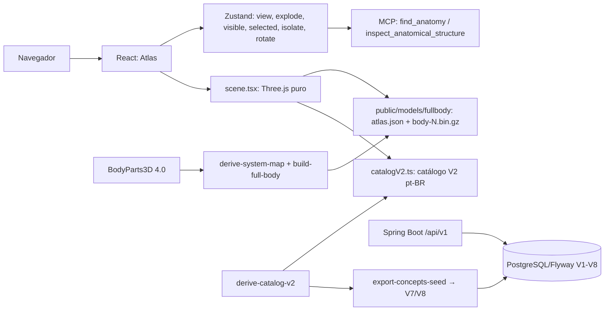
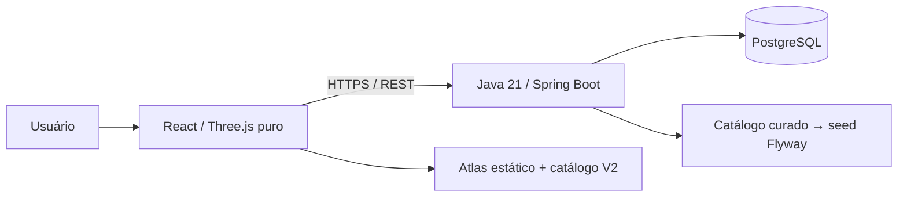

# Anatomia 3D

**Plataforma Web interativa para exploração tridimensional da anatomia humana.**

O Anatomia 3D tem como objetivo combinar renderização 3D em tempo real, dados anatômicos estruturados e uma API REST para transformar o navegador em um atlas humano interativo.

O Anatomia 3D é desenvolvido em etapas: após o **Milestone 01 (First 3D Viewer)** e a interação do MVP, a entrega atual corresponde ao **V2 "Human Atlas"** — o corpo humano completo (BodyParts3D 4.0) com renderer batched em Three.js puro, catálogo pt-BR por conceito e backend Java/Spring Boot com persistência em PostgreSQL.

| Informação | Estado |
| --- | --- |
| Status | MVP em desenvolvimento (V2 "Human Atlas") |
| Plataforma | Web, com prioridade para desktop |
| Finalidade | Educação, projeto acadêmico e portfólio |
| Entrega disponível | Atlas humano completo: 15 sistemas, 2.234 estruturas e 3.432 conceitos, renderer batched Three.js puro, painel de camadas com presets, busca por conceito, isolamento, explosão radial → **inventário**, vistas ¾/anteriores/posteriores/laterais, legendas de cena, loading progressivo, atalhos de teclado e integração MCP |
| Backend | Java 21 / Spring Boot com API `/api/v1` (estruturas, sistemas, regiões e conceitos) |
| Banco | PostgreSQL com migrations Flyway (V1–V8) |
| Docker Compose | Backend + PostgreSQL prontos para subir o stack |
| Catálogo educacional | Catálogo V2 derivado: 2.234 estruturas e 3.432 conceitos pt-BR, com curadoria incremental em andamento |
| Deploy público | Pendente |

> **Aviso educacional:** esta aplicação não realiza diagnósticos, não recomenda tratamentos e não substitui material de referência ou orientação profissional. O modelo e o conteúdo atual não foram submetidos a revisão clínica.

## Sumário

- [Visão Geral](#visão-geral)
- [Funcionalidades e Escopo](#funcionalidades-e-escopo)
- [Tecnologias](#tecnologias)
- [Pré-requisitos](#pré-requisitos)
- [Instalação e Execução](#instalação-e-execução)
- [Como Usar](#como-usar)
- [Comandos Disponíveis](#comandos-disponíveis)
- [Configuração e Ambiente](#configuração-e-ambiente)
- [Arquitetura](#arquitetura)
- [Estrutura do Projeto](#estrutura-do-projeto)
- [Modelo 3D e Pipeline](#modelo-3d-e-pipeline)
- [API e Banco](#api-e-banco)
- [Testes e Qualidade](#testes-e-qualidade)
- [Performance e Compatibilidade](#performance-e-compatibilidade)
- [Build e Publicação](#build-e-publicação)
- [Solução de Problemas](#solução-de-problemas)
- [Roadmap](#roadmap)
- [Documentação](#documentação)
- [Contribuição](#contribuição)
- [Licenças e Créditos](#licenças-e-créditos)

## Visão Geral

Livros, atlas e imagens 2D são recursos importantes no estudo da anatomia, mas nem sempre permitem compreender facilmente profundidade, sobreposição, proporções e relações espaciais entre estruturas.

O Anatomia 3D propõe uma experiência em que o usuário pode explorar o corpo humano diretamente: movimentar a câmera, observar diferentes perspectivas e, nas próximas etapas, selecionar estruturas e consultar informações educacionais associadas.

**Público-alvo:** estudantes da área da saúde, professores, estudantes de anatomia e pessoas interessadas em conhecimento científico.

Como projeto de portfólio, a evolução prevista demonstrará integração entre frontend, computação gráfica, API REST, persistência, testes e gestão de assets. A arquitetura completa é um objetivo de desenvolvimento, não uma descrição de componentes já entregues.

## Funcionalidades e Escopo

### Disponíveis

| Funcionalidade | Comportamento atual |
| --- | --- |
| Visualização 3D | Corpo humano completo (2.234 estruturas, 15 sistemas) como atlas binário em chunks por sistema |
| Rotação | Exploração por arrasto com OrbitControls |
| Zoom | Roda do mouse e botões de aproximação/afastamento |
| Pan | Deslocamento do alvo da câmera pelo mouse |
| Vistas anatômicas | Semivista (¾), anterior, posterior e lateral, com indicador no viewport (atalhos `4/1/2/3`) |
| Reset da câmera | Retorno à vista e ao enquadramento iniciais |
| Restauração geral | Restaura a vista, desativa rotação automática e explode, e retoma os sistemas padrão |
| Rotação automática | Movimento contínuo controlado por controle no rodapé |
| Hints de interação | Dicas contextuais no viewport (orbitar, deslocar, aproximar, tocar para inspecionar) |
| Legendas de cena | Fase da explosão e identificação do corpo: `CORPO HUMANO ADULTO`, `ESTRUTURAS SEPARADAS`, `INVENTÁRIO ANATÔMICO` |
| Tooltip de hover | Nome da estrutura sob o cursor enquanto explora a cena |
| Painel de camadas | Cards dos 15 sistemas com cor, descrição e contagem; presets **Todos**, **Esqueleto** e **Órgãos**, botão **Ocultar todos** e resumo `<N> de 2.234 peças visíveis` |
| Visibilidade de sistemas | Checkbox por sistema; o estado inicial mostra todas as peças |
| Busca por conceito | Campo com sugestões (atalho `/`) consulta 3.432 conceitos e 2.234 estruturas por nome pt-BR; escolher localiza a peça, isola-a e abre o painel de detalhes |
| Isolamento | "Isolar estrutura" oculta o restante; "Limpar seleção" ou "Montar e restaurar" desfaz |
| Visualização explodida | Slider de intensidade com três fases: montado, explosão radial e **inventário** (peças em grade com rótulos e câmera automática) |
| Integração MCP | Quando um host MCP está conectado (ex.: IDE com Decapod), expõe `find_anatomy` e `inspect_anatomical_structure` por conceito |
| Estados de carregamento | Overlay progressivo por chunk (`NN% · Carregando N/N peças`), erro do modelo e aviso de WebGL indisponível |
| Detalhe do conceito | Sheet com nome pt-BR, ID FMA, sistema, cores e contagem de peças selecionadas |
| Créditos | Diálogo com atribuição CC BY 4.0, licenças e download do modelo |
| Responsividade | Layout desktop (1440×900) e adaptação para telas estreitas (390×844) |

### Planejadas para o MVP

- Deploy do stack completo e observabilidade básica.
- Curadoria incremental do catálogo V2 (revisão didática dos nomes derivados por sistema).

### Fora do MVP

Diagnóstico médico, análise de exames, prontuários, autenticação obrigatória, aplicativos nativos, IA generativa, quizzes, gamificação, acompanhamento de alunos, realidade virtual e realidade aumentada não fazem parte da primeira versão.

## Tecnologias

### Em Uso

| Camada | Tecnologia | Papel |
| --- | --- | --- |
| Interface | React 19.2.8 e TypeScript | Componentes, eventos e tipagem |
| Desenvolvimento | Vite 8 | Servidor local e build estático |
| Renderização | Three.js (puro) | Cena WebGL batched (chunks binários + DataTextures) e controles |
| Estilos | CSS e Tailwind CSS 4 | Estilização e integração com Vite |
| Recursos visuais | Lucide e Fontsource | Ícones e fontes locais DM Sans/Manrope |
| Pipeline 3D | Meshoptimizer e three-stdlib | Simplificação, quantização (normais Int16) e compressão dos chunks |
| Qualidade | ESLint, Vitest e Playwright | Análise estática, testes unitários e smoke test de navegador |
| Verificação visual | pngjs | Análise dos pixels das capturas do canvas |
| Estado compartilhado | Zustand | Seleção, hover, sistemas visíveis e isolamento |
| Backend | Java 21 + Spring Boot 3.5 | API REST `/api/v1` |
| Persistência | PostgreSQL 17 + Flyway | Schema, dados de referência e seed de estruturas |
| Contratos de API | springdoc-openapi | Swagger UI e `/api-docs` |
| Infraestrutura | Docker Compose | PostgreSQL e backend em contêineres |

Zustand centraliza o estado de interação do atlas (`view`, `explode`, `visible`, `selected`, `isolate`, `rotate`). O catálogo V2 (`catalog/v2/structures.json` e `catalog/v2/concepts.json`) é consumido pelo frontend via `frontend/src/data/catalogV2.ts`.

### Stack Planejada

Não há stack backend pendente: Java 21, Spring Boot, Spring Data JPA, Flyway, PostgreSQL e Docker Compose já estão implementados. O deploy público continua em aberto.

As dependências e os scripts são definidos em [package.json](package.json) e [frontend/package.json](frontend/package.json). Os lockfiles registram as versões resolvidas para instalação reproduzível.

## Pré-requisitos

| Requisito | Quando é necessário |
| --- | --- |
| Node.js | Para instalar, desenvolver, testar e gerar o build; recomendado Node 24 LTS, validado com 24.14 |
| npm | Gerenciador utilizado pelo projeto; ambiente inicial validado com npm 11.9 |
| Java 21 (JDK) | Para compilar e testar o backend (Maven wrapper) |
| Maven | Fornecido pelo `mvnw` do backend; nenhuma instalação global obrigatória |
| Docker + Compose | Para subir o stack completo (PostgreSQL e backend) ou rodar os testes de integração |
| Navegador com WebGL 2 | Para visualizar e manipular a cena 3D |
| Aceleração gráfica ou implementação WebGL por software | Para renderização do modelo |
| `curl` | Somente para reconstruir o modelo a partir da fonte oficial |
| Chromium do Playwright | Somente para os testes de navegador |

O setup foi validado em Linux. Outros sistemas operacionais ainda precisam de verificação específica, principalmente para o pipeline que executa `curl` como processo externo.

## Instalação e Execução

Com o código disponível localmente, abra um terminal na **raiz do projeto**, onde estão as pastas `frontend`, `assets` e `scripts`.

### 1. Instalar as dependências

```sh
npm ci
npm --prefix frontend ci
```

Existem dois pacotes npm independentes: a raiz contém os comandos de conveniência e as ferramentas de assets; o frontend contém a aplicação. Instalar apenas na raiz não instala as dependências do frontend.

### 2. Iniciar a aplicação

```sh
npm run dev
```

Abra a URL exibida pelo Vite, normalmente **http://localhost:5173/**. Se a porta estiver ocupada, o servidor de desenvolvimento poderá selecionar outra; use a URL efetivamente informada.

Para definir explicitamente endereço e porta, execute o script do frontend:

```sh
npm --prefix frontend run dev -- --host 127.0.0.1 --port 5174
```

O atlas está incluído em [frontend/public/models/fullbody/atlas.json](frontend/public/models/fullbody/atlas.json) e nos chunks `body-N.bin.gz` da mesma pasta. **Não é necessário executar a importação de assets, configurar banco de dados ou criar variáveis de ambiente para abrir o viewer.** As fontes também são servidas localmente.

### 3. Backend e banco (opcional)

O viewer funciona sem backend. Para executar a API completos, suba o stack com Docker:

```sh
docker compose up -d
```

O backend fica disponível em `http://localhost:8080`, com Swagger UI em `http://localhost:8080/swagger-ui.html`. Para parar: `docker compose down`.

Alternativa sem Docker (requer PostgreSQL local com banco `anatomia`, usuário `anatomia` e senha enviada por `DATABASE_PASSWORD`):

```sh
(cd backend && JAVA_HOME=$HOME/.local/share/jdks/temurin21 ./mvnw spring-boot:run)
```

O viewer V2 não consome a API em tempo de execução: o atlas e o catálogo V2 são servidos com o frontend. A API permanece como contrato REST independente (Swagger em `http://localhost:8080/swagger-ui.html`).

## Como Usar

1. Abra a aplicação e aguarde o atlas carregar (overlay progressivo por chunk).
2. Arraste com o botão esquerdo para rotacionar a vista.
3. Use a roda do mouse ou os botões `+` e `−` para ajustar a distância; arraste com o botão direito para deslocar o alvo (pan).
4. Escolha a vista **¾**, **Anterior**, **Posterior** ou **Lateral** (atalhos `4/1/2/3`) para mudar a orientação; durante a explosão, apenas a vista anterior é permitida.
5. Passe o cursor sobre o corpo para ver o nome da estrutura sob o cursor.
6. Use o campo de **busca** (atalho `/`) para localizar uma estrutura por conceito ou nome (ex.: "coração"); escolher um resultado isola a peça, foca a câmera e abre o painel de detalhes com o ID FMA.
7. No painel de **camadas**, marque/desmarque sistemas ou use os presets **Todos**, **Esqueleto** e **Órgãos**; o botão **Ocultar todos** desliga todas as peças.
8. Use **Isolar estrutura** para ocultar o restante e **Limpar seleção** ou **Montar e restaurar** para voltar ao estado inicial.
9. Ajuste o slider de **Explodir anatomia**: até ~45% as peças se separam radialmente; acima disso entra a fase **inventário**, com as peças em grade e rótulos — volte a 0% para montar novamente.
10. Ative **Rotação automática**, conforme necessário.
11. Abra **Sobre e créditos** para consultar a atribuição e baixar o modelo.
12. Atalhos: `R` restaura tudo, `/` abre a busca, `4/1/2/3` alternam vistas e `Esc` fecha painéis e diálogos. Com o foco em um campo de texto, os atalhos de vista/restauração são ignorados (apenas `Esc` atua).

A exploração por toque segue os gestos do OrbitControls, mas ainda não foi certificada em dispositivos móveis reais. Botões e controles da interface podem ser acessados por teclado; o diálogo de créditos pode ser fechado com `Esc`.

## Comandos Disponíveis

Execute os comandos abaixo a partir da raiz:

| Comando | Resultado |
| --- | --- |
| `npm ci` | Instala as ferramentas da raiz conforme o lockfile |
| `npm --prefix frontend ci` | Instala as dependências da aplicação |
| `npm run dev` | Inicia o servidor Vite do frontend |
| `npm run build` | Executa TypeScript e gera o build de produção |
| `npm run lint` | Executa ESLint no frontend |
| `npm test` | Executa os testes Vitest da pasta de código-fonte |
| `npm --prefix frontend run test:e2e` | Executa o smoke test Playwright |
| `npm --prefix frontend run preview` | Serve localmente um build já gerado |
| `npm run atlas:derive` | Deriva o mapa de sistemas/conceitos do atlas (`assets/system-map.json`) |
| `npm run atlas:build` | Constrói os chunks do atlas (`atlas.json` + `body-N.bin.gz`) em `frontend/public/models/fullbody` |
| `npm run atlas:validate` | Valida o atlas gerado (contagens, offsets, checksum) |
| `npm run catalog:v2` | Deriva o catálogo V2 pt-BR (estruturas + conceitos) |
| `npm run catalog:v2:validate` | Valida o catálogo V2 (referências e nomes) |
| `npm run catalog:seed:v2` | Gera as migrations `V6`/`V7`/`V8` (estruturas expandidas, conceitos e vínculos) |
| `npm run assets:import` | Pipeline legado do recorte anterior (OBJ → GLB), mantido para histórico |
| `(cd backend && ./mvnw -B test)` | Testes do backend (JDK 21 via `JAVA_HOME`) |
| `docker compose up -d` | Sobe PostgreSQL e backend |

## Configuração e Ambiente

O viewer V2 carrega o atlas localmente (assets em `frontend/public/models/fullbody`) e não depende de API para funcionar. A API REST permanece como contrato independente para integração e consulta dos dados anatômicos.

[.env.example](.env.example) documenta o contrato de ambiente:

| Variável | Finalidade |
| --- | --- |
| `DATABASE_URL` | URL JDBC do PostgreSQL (`jdbc:postgresql://host:5432/anatomia`) |
| `DATABASE_USERNAME` | Usuário do banco |
| `DATABASE_PASSWORD` | Senha do banco, a ser definida fora do código |
| `CORS_ALLOWED_ORIGINS` | Origens autorizadas a consumir a API (separadas por vírgula) |

O banco, o backend e as migrations usam apenas variáveis com prefixo de backend; nada é incorporado ao JavaScript do navegador. Por padrão a API libera `http://localhost:5173` e `http://127.0.0.1:5173` (CORS).

[.gitignore](.gitignore) exclui arquivos de ambiente privados, dependências, builds, caches de assets e resultados de testes. O exemplo de ambiente pode ser versionado.

## Arquitetura

### Implementação Atual



- [frontend/src/main.tsx](frontend/src/main.tsx) inicializa a aplicação e monta o atlas.
- [frontend/src/Atlas.tsx](frontend/src/Atlas.tsx) contém o overlay studio: busca, painel de camadas, vistas, explosão, créditos, atalhos e o registro das ferramentas MCP.
- [frontend/src/features/viewer/atlas/scene.tsx](frontend/src/features/viewer/atlas/scene.tsx) é o renderer batched: carrega `atlas.json` + chunks, monta 1 `Mesh` por sistema com `DataTexture`, faz picking por `partIndex` no buffer, aplica explosão/isolação e enquadra as vistas.
- [frontend/src/store/atlas.ts](frontend/src/store/atlas.ts) centraliza vista, explosão, sistemas visíveis, seleção e isolamento (Zustand).
- [frontend/src/features/viewer/atlas/search.ts](frontend/src/features/viewer/atlas/search.ts) normaliza e ranqueia buscas por conceito/estrutura.
- [frontend/src/features/viewer/atlas/explosionLayout.ts](frontend/src/features/viewer/atlas/explosionLayout.ts) deriva os offsets radial → inventário.
- [frontend/src/data/catalogV2.ts](frontend/src/data/catalogV2.ts) lê `catalog/v2/structures.json` e `catalog/v2/concepts.json` (nome pt-BR, elementos FJ e ID FMA).
- [frontend/src/features/mcp/mcp.ts](frontend/src/features/mcp/mcp.ts) expõe `find_anatomy` e `inspect_anatomical_structure`.
- [frontend/src/atlas.css](frontend/src/atlas.css) define o layout e a identidade visual "studio".

A cena usa geometria de buffer única por sistema (posições em metros, escala 0.001 a partir de mm) com um atributo `partIndex` por vértice; a visibilidade e o hover entram por dados por parte no shader. Os chunks são descomprimidos no navegador (gzip) e o progresso é reportado por chunk. O picking lê o `partIndex` no buffer do clique, dispensando malhas individuais por estrutura.

### Arquitetura Alvo



**Princípio central: separar dados anatômicos da representação tridimensional.**

```text
partIndex (chunk) -> sourceId FJ -> conceito FMA / estrutura -> catálogo pt-BR -> painel educacional
```

Os chunks transportam apenas geometria e `partIndex`. A associação para `sourceId` FJ está em `assets/full-body-map.json` e `assets/system-map.json`; o conteúdo educacional em pt-BR está em `catalog/v2/` (estruturas e conceitos). A API REST expõe estruturas, sistemas, regiões e conceitos; controllers não expõem entidades JPA diretamente.

## Estrutura do Projeto

Visão dos principais arquivos atuais, omitindo dependências e saídas geradas:

```text
anatomia_3d/
├── frontend/
│   ├── public/models/fullbody/
│   │   ├── atlas.json
│   │   └── body-N.bin.gz (15 chunks)
│   ├── src/
│   │   ├── main.tsx
│   │   ├── Atlas.tsx
│   │   ├── atlas.css
│   │   ├── store/atlas.ts (estado + testes)
│   │   ├── data/catalogV2.ts (bridge do catálogo V2)
│   │   └── features/
│   │       ├── viewer/atlas/ (scene, search, explosionLayout, pointerTap, modelDownload, types, systems + testes)
│   │       └── mcp/ (integração MCP e testes)
│   ├── e2e/ (viewer, systems, search, ux + helpers)
│   ├── playwright.config.ts
│   ├── vite.config.ts
│   └── package.json
├── backend/
│   ├── src/main/java/com/anatomia3d/ (controller/service/repository/entity/dto/mapper/exception/config/util)
│   ├── src/main/resources/db/migration/ (V1 schema … V8 conceitos)
│   ├── src/test/java/com/anatomia3d/ (Testcontainers + MockMvc)
│   ├── pom.xml
│   └── Dockerfile
├── scripts/ (atlas: derive/build/validate; catálogo v2: derive/validate/seed; legados do recorte anterior)
├── catalog/v2/ (structures.json, concepts.json)
├── assets/ (licenses.json, structure-map.json, system-map.json, full-body-map.json)
├── compose.yaml
├── docs/ (DESIGN-DOC, ARCHITECTURE, DATABASE, API, ASSETS-LICENSING, ROADMAP, ADR/)
└── README.md
```

O ponto de entrada do frontend é `Atlas.tsx`. O backend é um aplicativo Spring Boot independente em `backend/`, executado por Docker Compose ou pelo Maven wrapper. O catálogo V2 em `catalog/v2/` é consumido diretamente pelo frontend e alimenta os seeds de conceitos do banco (V7/V8).

## Modelo 3D e Pipeline

### Asset Atual (atlas full-body)

| Propriedade | Valor |
| --- | --- |
| Fonte | BodyParts3D, versão 4.0 (objeto completo) |
| Representação | Corpo humano completo em 15 sistemas com 2.234 estruturas |
| Formato | `atlas.json` + 15 chunks binários `body-N.bin(.gz)` (posições float32, normais Int16, índices uint32) |
| Compressão | gzip por chunk; descomprimido no navegador |
| Unidades | milímetros (convertidos para metros no loader) |
| Triângulos | 2.104.882 |
| Tamanho | ~25 MB em gzip (chunks) + `atlas.json` |
| Sistema/conceito | 15 sistemas, 3.432 conceitos FMA (classificação conforme `ashemag/human-atlas`) |
| Licença registrada | CC BY 4.0 |
| Data de obtenção registrada | 14 de setembro de 2026 |

A geometria por sistema é carregada como um único mesh batched (1 draw call por chunk). Cada parte expõe um `partIndex` global no buffer; o picking lê o `partIndex` no ponto de clique e o associado a `sourceId` FJ via `assets/full-body-map.json`.

### Catálogo V2 (estruturas e conceitos)

`scripts/derive-catalog-v2.mjs` deriva o catálogo pt-BR a partir dos nomes EN do atlas: `catalog/v2/structures.json` (2.234 estruturas) e `catalog/v2/concepts.json` (3.432 conceitos, com `elements` = ids FJ e `id` = FMA). Cada entrada tem nome pt-BR derivado por regras de ordem de tokens, gênero/número e padrões específicos (dentes, vacúolos musculares, folhetos valvulares, árvore biliar e cardiovasculares). `npm run catalog:v2:validate` garante referências íntegras com 0 erros; a curadoria incremental fica em `catalog/v2/curated.json`.

### Reconstrução do Atlas (opcional)

O pipeline é reexecutável a partir da fonte oficial (BodyParts3D 4.0), mantendo os mapas de IDs entre execuções:

```sh
npm run atlas:derive    # mapas de sistemas/conceitos -> assets/system-map.json
npm run atlas:build     # chunks + atlas.json -> frontend/public/models/fullbody
npm run atlas:validate  # validação (contagens, offsets, checksum)
npm run catalog:v2      # catálogo pt-BR derivado
npm run catalog:v2:validate
```

O processo implementado em `scripts/build-full-body.mjs`: importa o OBJ completo, rotaciona Z-up → Y-up, solda vértices (0,1 mm), aplica simplificação meshoptimizer (0,22x com erro relativo 0,2% por estrutura, como a referência), quantiza normais para Int16, agrupa por sistema e grava cada chunk com offsets de bytes em `atlas.json`. Os arquivos `*.bin` não versionados são intermediários do build; apenas os `*.bin.gz` acompanham o frontend.

## API e Banco

**A API REST e o banco estão implementados.** Base: `/api/v1`; documentação interativa em `http://localhost:8080/swagger-ui.html`.

| Método | Endpoint | Finalidade |
| --- | --- | --- |
| GET | `/api/v1/systems` | Listar sistemas anatômicos |
| GET | `/api/v1/regions` | Listar regiões anatômicas |
| GET | `/api/v1/structures` | Listar e pesquisar estruturas (`search`, `system`, `region`, `page`, `size`) |
| GET | `/api/v1/structures/{id}` | Consultar os dados de uma estrutura |
| GET | `/api/v1/structures/{id}/relations` | Consultar relações anatômicas |
| GET | `/api/v1/structures/{id}/concepts` | Consultar os conceitos (FMA) que agrupam uma estrutura |
| GET | `/api/v1/concepts` | Listar e pesquisar conceitos (`search`, `system`, `page`, `size`, por nome pt-BR ou FMA) |
| GET | `/api/v1/concepts/{id}` | Consultar um conceito e suas estruturas |
| GET | `/api/v1/assets/{structureId}` | Consultar assets associados |

A listagem de estruturas e conceitos suporta `search`, `system`, `page` e `size`, com normalização sem acentos. Contrato detalhado em [docs/API.md](docs/API.md).

O modelo relacional inclui `ANATOMICAL_SYSTEM`, `ANATOMICAL_REGION`, `ANATOMICAL_STRUCTURE` (com `source_id`), `ALTERNATE_NAME`, `STRUCTURE_RELATION`, `ASSET`, `SOURCE_LICENSE`, `ANATOMICAL_CONCEPT` e `CONCEPT_STRUCTURE`; as migrations estão em [backend/src/main/resources/db/migration](backend/src/main/resources/db/migration) (V1–V8). Regras e entidades em [docs/DATABASE.md](docs/DATABASE.md).

**Catálogo V2 (estruturas e conceitos):** o catálogo pt-BR em [catalog/v2](catalog/v2) é a base de curadoria do V2 e alimenta os seeds do banco: `catalog:seed:v2` gera `V6__seed_expanded_structures.sql` (as 2.234 estruturas derivadas com `source_id`), `V7__seed_concepts.sql` (3.432 conceitos FMA com `name_pt`) e `V8__seed_concept_structures.sql` (46.825 vínculos conceito→estrutura por `source_id`).

**Relações anatômicas (legado):** o conjunto curado em [catalog/relations.json](catalog/relations.json) (articulações e origem/inserção) e a migration `V4` permanecem versionados e expostos pela API do endpoint `/structures/{id}/relations`; o viewer V2 não consome mais esse módulo no frontend.

## Testes e Qualidade

### Verificações Locais

```sh
npm test
npm run lint
npm run build
```

O comando `npm test` executa somente os testes Vitest do código-fonte; os testes Playwright são executados separadamente.

### Testes de Navegador

Na primeira execução, instale o Chromium utilizado pelo Playwright:

```sh
npm --prefix frontend exec -- playwright install chromium
npm --prefix frontend run test:e2e
```

[frontend/playwright.config.ts](frontend/playwright.config.ts) inicia o Vite em `http://127.0.0.1:5173` quando necessário e reutiliza um servidor existente nesse endereço. Certifique-se de que a porta pertence a esta aplicação. Outra porta usada no desenvolvimento não altera automaticamente a configuração do teste.

O navegador de teste usa SwiftShader para oferecer WebGL por software. Por ser mais lento que uma GPU, as verificações possuem tolerância de 30 segundos e limite de 240 segundos por teste.

### Cobertura Atual

| Camada | Verificações existentes |
| --- | --- |
| Estado | Testes unitários do store Zustand (vista, explosão, sistemas visíveis, seleção/isolamento e restauração) |
| Busca | Testes de normalização do catálogo V2, ranking por conceito/estrutura, sugestões e limites |
| Explosão | Testes do layout de explosão (fases montado/radial/inventário) e offsets da grade |
| MCP | Testes das ferramentas `find_anatomy` e `inspect_anatomical_structure` por conceito (FMA) |
| Renderização | E2E de carregamento do atlas (chunks) e detecção de pixels visíveis no canvas |
| Interação | E2E de zoom, mudança de vistas anatômicas, enquadramento e gesto de arrasto no canvas |
| Busca E2E | E2E de busca por conceito (ex.: coração) → detalhe com FMA → isolar → limpar → `Esc` |
| Sistemas e explosão | E2E dos presets/contagens, legendas de cena, ocultar tudo, transição radial → inventário e manutenção das peças visíveis ao explodir/mover a câmera |
| Experiência | E2E de atalhos de teclado (vistas ¾/F/S/B, `/`, restore e `Esc`) e estado inicial das vistas |
| Interface | E2E de abertura/fechamento do diálogo de créditos |
| Responsividade | Capturas em 1440×900 e 390×844, limites da silhueta e ausência de overflow horizontal |
| Backend | 32 testes (serviços de estruturas/sistemas/conceitos e integração Testcontainers + MockMvc) |
| Execução | Verificação de erros JavaScript na página |

As capturas são verificações de renderização e enquadramento, não uma certificação de exatidão anatômica ou uma suíte completa de regressão visual. Os testes unitários estão em `frontend/src/**/*.test.ts` e os E2E em `frontend/e2e/`; os resultados são ignorados pelo Git.

## Performance e Compatibilidade

### Estratégias Aplicadas

- Atlas comprimido com gzip em chunks por sistema; descompressão por streaming no navegador.
- 1 draw call por chunk (15 malhas batchadas com DataTextures por parte); visibilidade e hover controlados no shader.
- Rendering sob demanda quando a rotação automática está desligada.
- Limite de densidade de pixels do canvas para conter o custo de renderização em telas HiDPI.
- Leitura do `partIndex` por buffer no clique, sem malhas individuais por estrutura.
- Fontes locais (DM Sans/Manrope), sem dependência de Google Fonts em tempo de execução.

O modelo possui cerca de 2,1 milhões de triângulos. O chunk `index` do Vite reporta ~3,4 MB (gzip ~325 kB), mas a carga real por chunk do atlas é significativamente menor (~2 MB gzip no total para todos os 15 chunks).

### Navegadores e Acessibilidade

Chrome, Edge, Firefox e Safari são alvos do projeto. A validação automatizada disponível utiliza **Chromium**; não implica certificação dos demais navegadores nem de dispositivos móveis reais.

A interface utiliza elementos semânticos, nomes acessíveis para botões, foco visível, checkboxes e diálogo nativo. Não há auditoria completa de acessibilidade, e a exploração do canvas ainda depende predominantemente de interações gráficas.

## Build e Publicação

```sh
npm run build
npm --prefix frontend run preview
```

O resultado é gerado em `frontend/dist`. O comando `preview` permite verificar esse build localmente; **não é um servidor de produção**.

Para publicar somente o viewer atual em um serviço de hospedagem estática:

| Configuração | Valor |
| --- | --- |
| Diretório de trabalho do serviço | `frontend` |
| Instalação | `npm ci` |
| Build | `npm run build` |
| Diretório de publicação | `dist` |

Não é necessário reconstruir o atlas durante o deploy, pois os chunks já acompanham o frontend. Publique todo o conteúdo gerado, incluindo `dist/models/fullbody`, e preserve as atribuições em `assets/licenses.json`.

O viewer carrega o atlas a partir de `public/models/fullbody/atlas.json` (caminho relativo servido pelo Vite com `base: './'`). Se publicar em um subdiretório, ajuste a configuração do Vite antes do build.

Use HTTPS em produção. Backend, banco e CORS já têm configuração Docker Compose local; o deploy público em serviço de hospedagem, banco gerenciado e storage/CDN ainda é etapa separada.

## Solução de Problemas

| Sintoma | Verificação e ação |
| --- | --- |
| `Missing script: dev` | Confirme que está na raiz correta ou execute `npm --prefix frontend run dev`. Confira se está usando os arquivos atuais do projeto. |
| Vite ou módulos não encontrados | Instale também o pacote do frontend com `npm --prefix frontend ci`; a instalação da raiz não o substitui. |
| `WebGL indisponível` | Abra a aplicação em um navegador externo com WebGL 2 e aceleração gráfica habilitada. O navegador integrado do VS Code pode não disponibilizar esse recurso. |
| Modelo não carrega | Verifique as requisições de `/models/fullbody/atlas.json` e `body-*.bin.gz` na aba Network, a presença dos assets e se o site está hospedado na raiz ou subdiretório configurado no Vite. |
| Conflito de dependências (R3F/drei legados) | As dependências legadas R3F/drei ainda constam no lockfile, mas não são importadas pela aplicação; preserve as versões e os lockfiles, sem `--force` ou `--legacy-peer-deps`. |
| Porta de desenvolvimento ocupada | Use a URL informada pelo Vite ou defina outra porta pelo script do frontend. Nos testes, verifique especificamente a porta 5173. |
| Playwright não encontra Chromium | Execute `npm --prefix frontend exec -- playwright install chromium`. |
| Chromium não inicia por bibliotecas do sistema ausentes | Consulte a mensagem do Playwright e instale os requisitos do seu sistema conforme a documentação oficial; a instalação do navegador não fornece todas as bibliotecas do Linux. |
| Timeout no teste visual | Renderização por software pode ser lenta. Confira os recursos disponíveis e os logs antes de aumentar os limites ou enfraquecer as asserções. |
| Importação lenta ou falha de HTTP Range | Confira a disponibilidade da fonte e do `curl`. O script pode usar um ZIP oficial completo local; não utilize downloads parciais como se fossem arquivos íntegros. |
| Aviso de chunk acima de 500 kB | É uma limitação conhecida do módulo 3D. O aviso não equivale a falha de build; mantenha-o como item de otimização. |

## Roadmap

| Marco | Objetivo | Situação |
| --- | --- | --- |
| Preparação do frontend | Ambiente React/TypeScript e ferramentas | Entregue |
| First 3D Viewer | Modelo, câmera, luzes e controles | Entregue (legado, substituído pelo V2) |
| Backend e persistência | Java, Spring Boot, PostgreSQL e Flyway | Entregue |
| API REST v1 | Contratos `/api/v1` (estruturas, sistemas, regiões) | Entregue |
| Interação | Seleção, highlight, painel por estrutura | Entregue |
| Sistemas | Filtros, mostrar/ocultar e isolamento | Entregue |
| Catálogo pt-BR V1 | Geração, curadoria e validação das 720 estruturas | Entregue (720/720; seed V3) |
| Relações anatômicas | Articulações (bidirecional) e origem/inserção | Entregue (legado; seed V4) |
| Explodida | Slider de intensidade (radial) com reset | Entregue |
| Inventário anatômico | Fase de alta explosão com grade, rótulos e câmera automática | Entregue |
| Vistas e navegação | Semivista ¾, anterior/posterior/lateral, hints, tooltip e legendas de cena | Entregue |
| Loading progressivo | Overlay com porcentagem e peças por chunk | Entregue |
| Integração MCP | Ferramentas `find_anatomy` e `inspect_anatomical_structure` | Entregue |
| Experiência de uso | Feedback de hover, atalhos de teclado e diálogos acessíveis | Entregue |
| **Expansão V2 — atlas full-body** | Corpo humano completo: 2.234 estruturas, 15 sistemas, 3.432 conceitos FMA (D1–D4) | Entregue |
| **Modelo e chunks** | Simplificação 0,22x, normais Int16, gzip por sistema, `atlas.json` + 15 `body-N.bin.gz` | Entregue |
| **Catálogo V2** | Estruturas e conceitos pt-BR derivados (`catalog/v2`), seeds V6–V8 | Entregue |
| **Renderer batched** | Three.js puro, 1 draw call/sistema, picking por `partIndex`, DataTextures | Entregue |
| **UI Atlas** | Overlay studio: camadas, busca por conceito, explosão, vistas, atalhos e detalhe | Entregue |
| **Testes V2** | 25 testes unitários + 6 E2E (Vitest + Playwright/SwiftShader) | Entregue |
| Curadoria incremental V2 | Revisão dos nomes derivados por sistema | Em evolução |
| Otimização e qualidade | Profiling, acessibilidade, matrix de navegadores | Em evolução |
| Infraestrutura e deploy | Deploy completo e observabilidade | Planejado |

Depois do MVP, poderão ser considerados favoritos, histórico, comparação, aulas, quizzes e acompanhamento de estudantes. IA, busca semântica e experiências WebXR ficam para versões posteriores. Uma futura IA deverá trabalhar sobre conteúdo aprovado e não atuar como fonte primária da informação anatômica.

Checklist detalhado e decisões de arquitetura: [docs/ROADMAP.md](docs/ROADMAP.md).

## Documentação

| Documento | Conteúdo |
| --- | --- |
| [docs/DESIGN-DOC.md](docs/DESIGN-DOC.md) | Síntese operacional do documento-base, escopo e critérios do MVP |
| [docs/ARCHITECTURE.md](docs/ARCHITECTURE.md) | Arquitetura atual e arquitetura alvo |
| [docs/DATABASE.md](docs/DATABASE.md) | Entidades, regras e migrations do banco |
| [docs/API.md](docs/API.md) | Contrato REST e endpoints |
| [docs/ASSETS-LICENSING.md](docs/ASSETS-LICENSING.md) | Origem dos modelos, pipeline e obrigações de licença |
| [docs/ROADMAP.md](docs/ROADMAP.md) | Entregas, pendências e evolução |
| [docs/CONTRIBUTING.md](docs/CONTRIBUTING.md) | Convenções e verificações para contribuição |
| [docs/ADR/ADR-001-react.md](docs/ADR/ADR-001-react.md) | React e TypeScript |
| [docs/ADR/ADR-002-threejs.md](docs/ADR/ADR-002-threejs.md) | Three.js (puro; R3F/Drei superados) |
| [docs/ADR/ADR-003-spring-boot.md](docs/ADR/ADR-003-spring-boot.md) | Backend Java/Spring Boot |
| [docs/ADR/ADR-004-postgresql.md](docs/ADR/ADR-004-postgresql.md) | Persistência PostgreSQL |
| [docs/ADR/ADR-005-glb.md](docs/ADR/ADR-005-glb.md) | GLB (superado pelos chunks binários do atlas) |
| [docs/ADR/ADR-006-zustand.md](docs/ADR/ADR-006-zustand.md) | Estado de interação com Zustand |
| [docs/ADR/ADR-007-catalog.md](docs/ADR/ADR-007-catalog.md) | Catálogo pt-BR (V1; V2 em ADR-008) |
| [docs/ADR/ADR-008-atlas-batched.md](docs/ADR/ADR-008-atlas-batched.md) | Atlas full-body em chunks batched e catálogo V2 |

## Contribuição

1. Consulte o design doc e identifique se a mudança pertence ao marco atual.
2. Mantenha alterações pequenas e separação entre interface, cena, dados e persistência.
3. Adicione ou ajuste testes para o comportamento alterado.
4. Execute testes unitários, lint e build; para alterações 3D, execute também os testes de navegador e revise as capturas.
5. Atualize a documentação e, quando aplicável, o mapa de IDs e o inventário de licenças.
6. Descreva o problema, a mudança, a verificação realizada e as limitações conhecidas ao compartilhar a contribuição.

Convenção de commits: `feat:`, `fix:`, `perf:`, `docs:`, `test:` e `chore:`. O fluxo de branches previsto utiliza `main`, `develop`, `feature/*` e `fix/*`; isso é uma convenção de trabalho, não uma indicação de branches já criadas.

Não inclua credenciais, dados pessoais, arquivos de pacientes ou assets sem autorização. Não renumere identificadores publicados e não remova o mapa existente para reconstruí-lo do zero.

Orientações adicionais em [docs/CONTRIBUTING.md](docs/CONTRIBUTING.md).

## Licenças e Créditos

### Código

O código do projeto é distribuído sob a **licença MIT** ([LICENSE](LICENSE)), conforme definido pelo responsável. A licença MIT não se aplica aos modelos 3D incorporados, que mantêm suas próprias licenças (abaixo).

### Modelo Anatômico (Atlas Full-Body)

O atlas incorporado foi obtido diretamente do **BodyParts3D 4.0** (objeto completo), disponibilizado pelo **The Database Center for Life Science**, com a classificação de sistemas e conceitos herdada do projeto de referência **ashemag/human-atlas**.

- [Fonte oficial e downloads](https://dbarchive.biosciencedbc.jp/en/bodyparts3d/download.html).
- [Página oficial de licença](https://dbarchive.biosciencedbc.jp/en/bodyparts3d/lic.html), atualizada em 27 de fevereiro de 2025, verificada na obtenção do asset em 10 de setembro de 2026 e reconciliada em 14 de setembro de 2026.
- [Creative Commons Attribution 4.0 International](https://creativecommons.org/licenses/by/4.0/).

A página oficial declara **CC BY 4.0**, que supera o texto histórico `CC BY-SA 2.1 JP` presente nos comentários dos OBJ; a licença vigente permite redistribuição e obras derivadas com atribuição.

Atribuição registrada:

> BodyParts3D, © The Database Center for Life Science, licensed under CC Attribution 4.0 International. System/concept classification per ashemag/human-atlas (derived from BodyParts3D 4.0, CC BY 4.0).

O projeto aplica transformações sobre o asset oficial: rotação Z-up → Y-up, solda de vértices, simplificação meshoptimizer (0,22x), quantização de normais (Int16), agrupamento por sistema e compressão gzip por chunk. As alterações, os links de origem, as permissões e o checksum estão registrados em [assets/licenses.json](assets/licenses.json).

### Z-Anatomy (arquivado)

Os módulos musculares do **Z-Anatomy** e do recorte esquelético anterior foram arquivados como assets legados (GLB) e seus pipelines mantidos nos scripts; o viewer V2 não os consome mais. As licenças e checksums permanecem registrados em `assets/licenses.json`.

### Fontes e Ícones

DM Sans e Manrope são distribuídas via Fontsource, com licenças OFL presentes nos pacotes. Os ícones Lucide seguem a licença ISC do pacote. Outras dependências mantêm suas respectivas licenças e obrigações.

Consulte [docs/ASSETS-LICENSING.md](docs/ASSETS-LICENSING.md) antes de adicionar ou publicar qualquer novo asset.